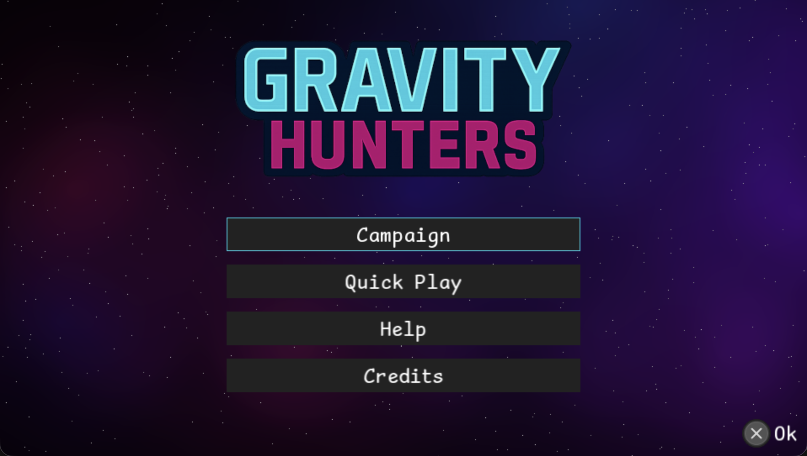

# Gravity Hunters

Gravity Hunters is a physics-driven artillery homebrew shooter designed for the PlayStation Vita. Pilot a nimble spaceship, bend your shots around planetary gravity, and clear handcrafted missions. Every turn asks you to balance movement, shot power, and energy management. Long projectile curves are rewarded with score multipliers and increased damage.

The project was developed for the [REIHEN PS Vita Homebrew Contest](https://itch.io/jam/reihen-ps-vita-homebrew-contest) in 2025.


## Screenshots




## Highlights

- **Mission-based campaign with 12 Levels**
- **Quickplay** 
- **Lightweight UI**

## Technical Overview

Gravity Hunters is written in C and powered by SDL2, SDL2_image, SDL2_ttf, and SDL2_mixer.  
Key subsystems include:

- **Rendering:** Immediate-mode draw helpers layered over SDL textures and fonts. Mission and overlay screens are composed from reusable renderer utilities in `src/services/`.
- **World simulation:** The `src/game/` module maintains entities, gravity-influenced trajectories, scoring logic, and mission goals.
- **Scenes & overlays:** A custom scene stack (see `src/app/scene.c`) drives menus, campaign missions, tutorials, and pause screens with separated update/render/input paths.
- **Asset pipeline:** Levels live as JSON sources in `assets/levels/*.json` and are converted to runtime `.lvl` binaries via `assets/levels/level_compiler.py`. Audio, fonts, and HUD atlases are bundled directly into the Vita `.vpk`.

## Building

### Prerequisites

[VitaSDK](https://vitasdk.org/) installed with the `VITASDK` environment variable set

All commands below should be executed from the repository root.

### PS Vita build

```bash
make vita
```

The resulting package `gravity_hunters.vpk` is produced in `build/vita/` alongside a `gravity_hunters.self` for testing on dev hardware.

### Testbuild

For debugging you can also build the game for pc. But it's limited to the Vita's resolution and the input with the keyboard is not so great.
It's a Vita game and no PC game...

```bash
make pc
./build/pc/gravity_hunters
```

The executable and supporting assets are generated under `build/pc/`.

## Project Structure

- `src/` — Source for game, engine, and UI code.
- `assets/` — Art, audio, and level data.
- `sce_sys/` — Vita LiveArea assets and metadata.

## License & Credits

Third-party licenses are stored under `licenses/`. See `assets/credits.txt` for in-game acknowledgements and attribution details.
